# Food Delivery Backend on Kubernetes (Spring Boot + Helm + Jenkins)

I took a Spring Boot food delivery backend and learned how to run it properly: Docker, Kubernetes, Helm and Jenkins.
Everything here ran on my own laptop (Docker Desktop + kind). The screenshots are real, from my own runs.

A simple way I think about it: the cluster is a building, each namespace is a floor, pods are the staff, and the Deployment is the manager who keeps the right number of staff on duty.

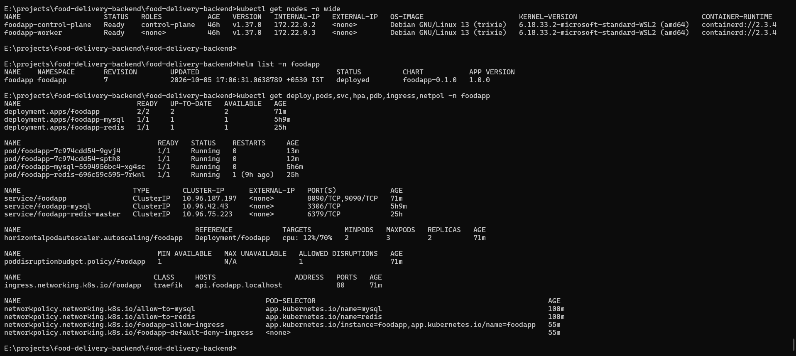

## What I used

| Part | Tools |
|---|---|
| App | Java 21, Spring Boot 4.0.0, Spring Security (JWT), JPA, Flyway, Redis cache, rate limiting, Swagger |
| Data | MySQL 8.4 (on a volume), Redis 7.4 |
| Container | Multi-stage Dockerfile, small Alpine JRE image, non-root user |
| Kubernetes (kind) | Deployment, Service, ConfigMap, Secret, PVC, HPA, PodDisruptionBudget, Ingress (Traefik), NetworkPolicy, metrics-server |
| Packaging | Helm chart with local and production values |
| CI/CD | Jenkins pipeline as code |
| Tracing | OpenTelemetry into Grafana Tempo |

## What the app does

Login and roles, categories, menu, cart, orders, payments (Stripe), reviews, notifications. Swagger UI documents the API.
This repo is about the part I worked on: running that app well. The Dockerfile, the Kubernetes setup, the Helm chart, the Jenkins pipelines and the tracing.

## How it fits together

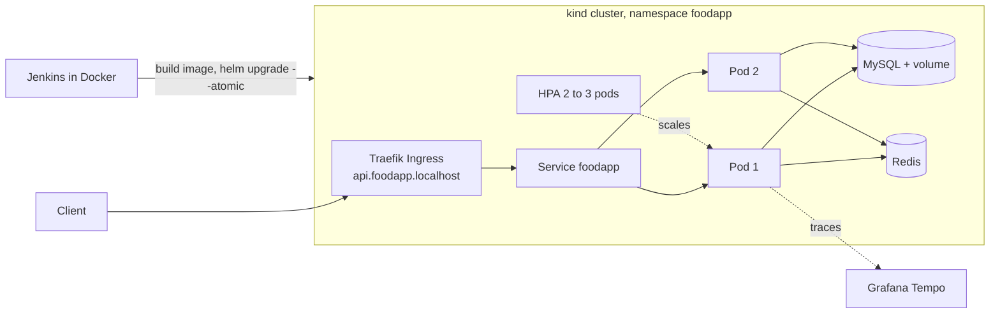

## What I did, step by step

### 1. Put the app in a container

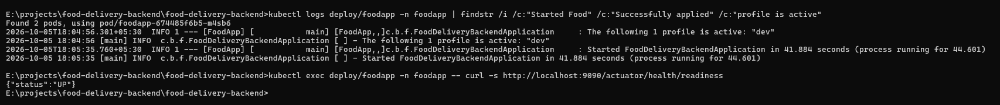

The app starts in about 42 seconds with the `dev` profile, and the readiness check says `UP`.

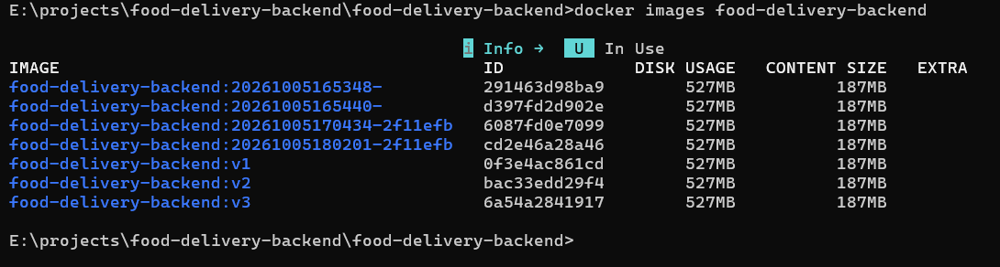

The image uses a multi-stage build: Maven builds the app, and only a small JRE is kept in the final image (187 MB of content, 527 MB on disk).

### 2. Run it on Kubernetes

| Cluster and workloads | Autoscaling and storage |
|---|---|
| 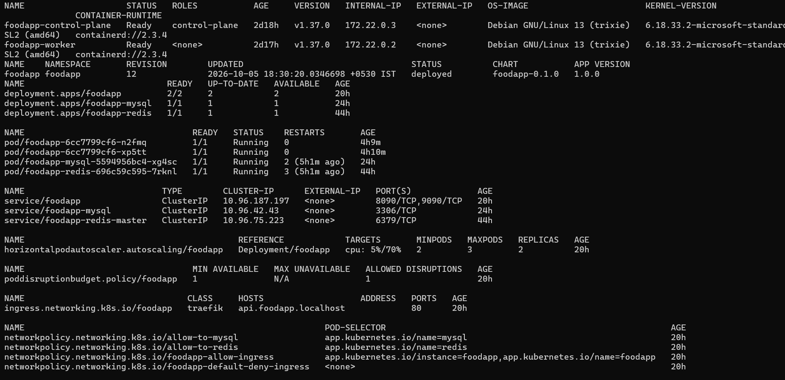 | 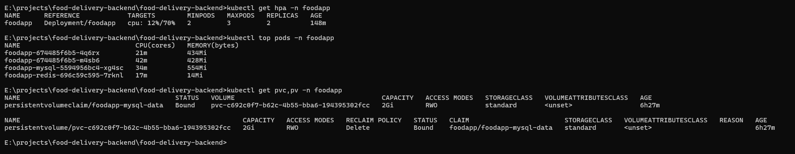 |

Two-node cluster, 2 app pods, a service, HPA, PodDisruptionBudget, Ingress and NetworkPolicies.
The picture at the top is from earlier (Helm revision 7). The one on the left here is the same view later (revision 12), after more releases.
On the right: the HPA at 12% of its 70% CPU target, live CPU and memory per pod, and the MySQL volume (2 Gi, `Bound`).

### 3. See it heal itself

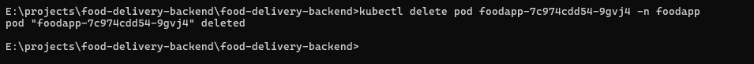

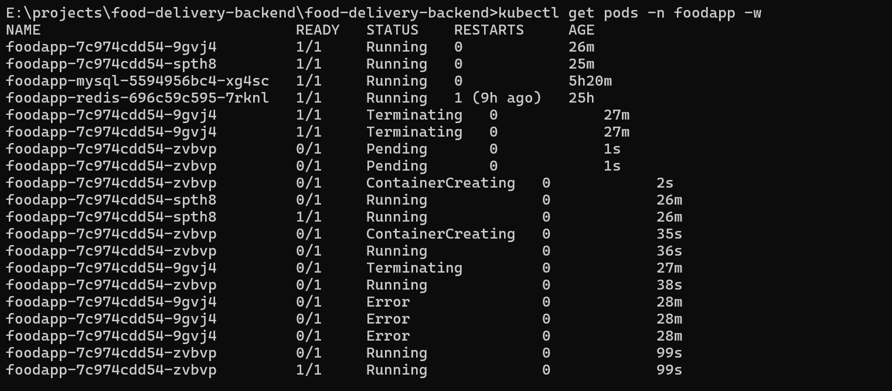

I deleted one app pod. The Deployment started a new one while the other pod kept running.
On my laptop the app takes 40 to 100 seconds to become Ready.

<!--
UNCOMMENT THIS BLOCK ONLY AFTER A VALID RE-RUN.
1. Run local\zero-downtime.cmd (the fixed version).
2. In the final pod list, one pod must be new (young age). If both pods keep their old age, no pod was deleted and the run is not valid.
3. Save the screenshot as docs/images/04-zero-downtime-rerun.png
4. Fill in the real numbers below, then remove the comment markers.

#### Requests keep working while a pod is replaced


A loop sent one request per second through the Ingress for 40 seconds. At second 8 I deleted one app pod.
Result: X of 40 requests returned 200 (fill in from your run).
-->


### 4. Release safely with Helm

| A bad image: the new pod cannot start | Helm rolls the release back |
|---|---|
| 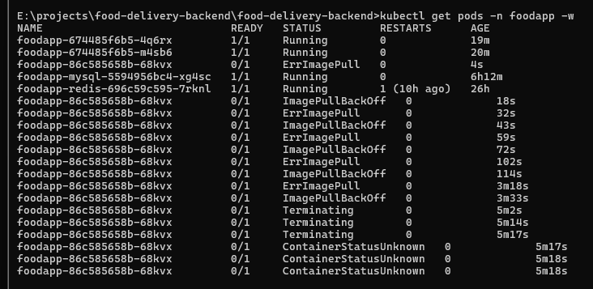 | 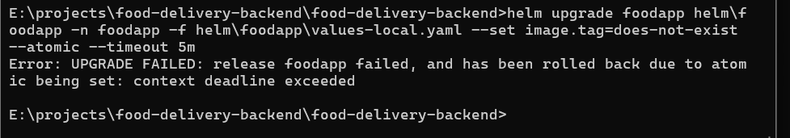 |

I deployed an image tag that does not exist, on purpose. The old pods stayed `1/1` the whole time. Because I used `--atomic`, Helm rolled the release back by itself.
Helm keeps every deploy as a numbered revision. I did this test twice, and both are in the history.

**First try (revisions 1 to 7):** revision 2 failed, revision 3 is the automatic `Rollback to 1`.

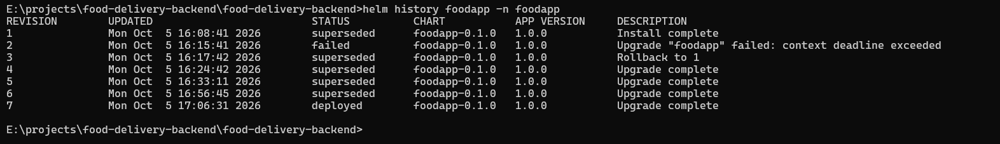

**Later (revisions 7 to 12):** revisions 9 and 11 failed, and revisions 10 and 12 are the rollbacks.

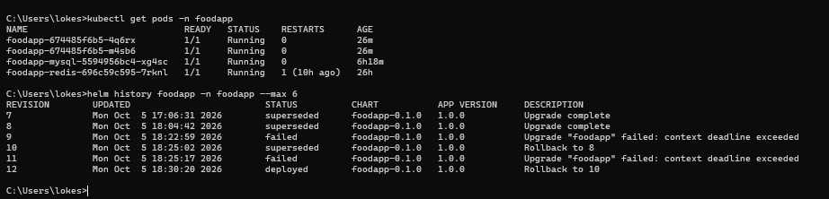

### 5. Traffic and security

| A request through the Ingress | NetworkPolicy test |
|---|---|
| 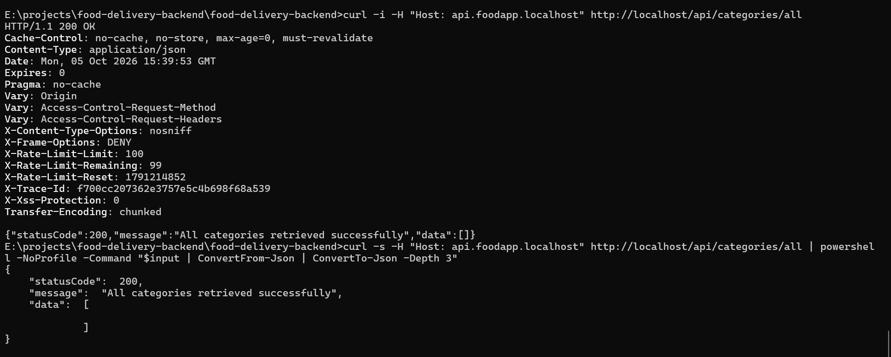 | 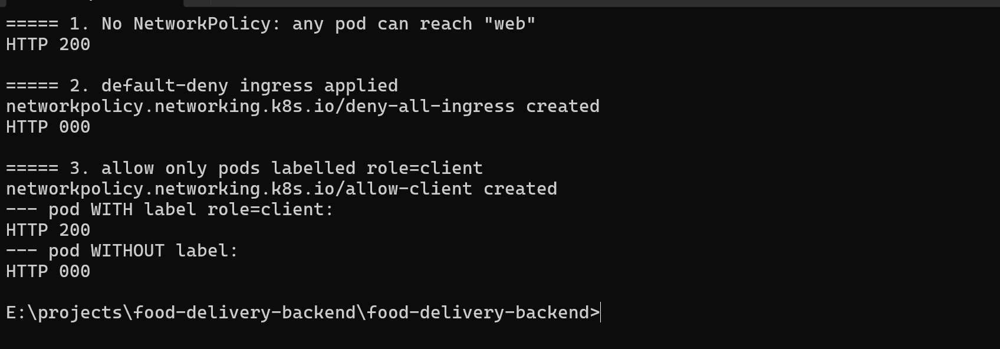 |

Left: `GET /api/categories/all` goes through Traefik and returns 200, with rate-limit headers and a trace id.
Right: with no policy the call works (200). With default-deny it fails. With an allow rule, only pods labelled `role=client` get through.

### 6. Jenkins

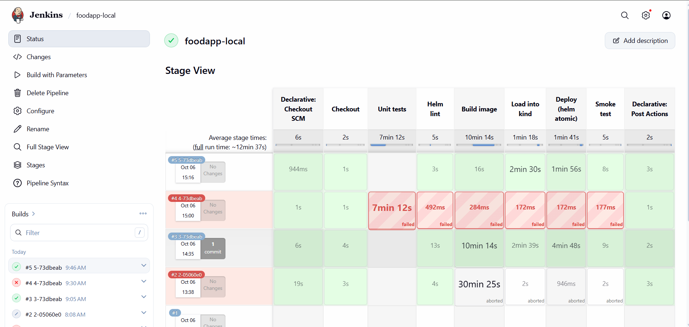

| Pipeline graph, run #5 | Console |
|---|---|
| 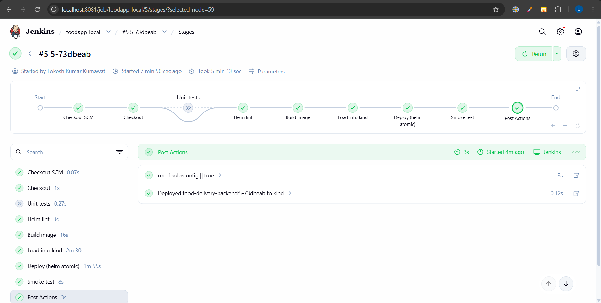 | 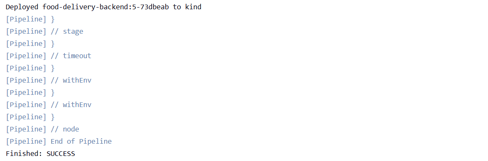 |

The pipeline checks out the code, lints the Helm chart, builds the image, loads it into kind, runs `helm upgrade --install --atomic`, then smoke-tests the readiness endpoint. Unit tests are an optional stage (off by default).

<details>
<summary>My Jenkins runs, including the ones that failed</summary>

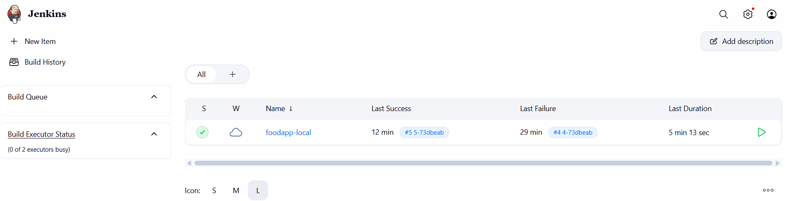

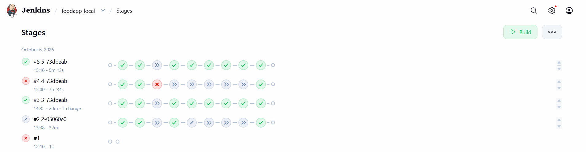

| Run | Result | What happened |
|---|---|---|
| #1 | Failed after 1 s | The job was not yet pointed at my repository |
| #2 | Aborted at 30 min | Cold cache and a slow image build hit my timeout |
| #3 | Success (20 min) | First full run. Build image took 10 min 14 s |
| #4 | Failed in Unit tests | I switched tests on once. They failed after 7 min 12 s. I have not looked into it yet |
| #5 | Success (5 min 13 s) | Layers were cached, so Build image took 16 s |

</details>

### 7. See what the app is doing

| A trace in Grafana Tempo | Swagger UI through the Ingress |
|---|---|
| 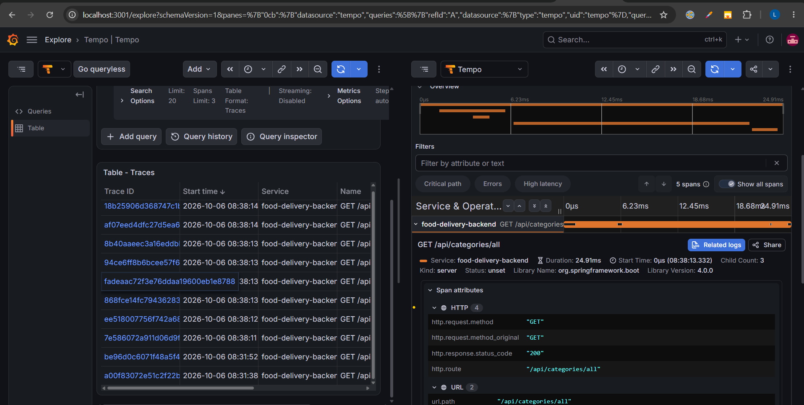 | 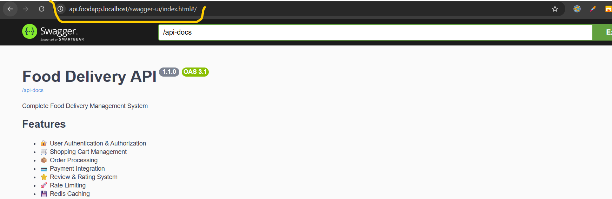 |

## Things that broke and how I fixed them

| What broke | Why | How I fixed it |
|---|---|---|
| Pod in `CrashLoopBackOff`: `ClassNotFoundException: JarLauncher` | My Dockerfile started the old Spring Boot launcher, but the layered JAR runs with `java -jar` | Renamed the JAR to `application.jar` and changed the `ENTRYPOINT` |
| Pod crashed on Flyway: failed migration to version 3 | `baseline-on-migrate` skipped V1 because a test table of mine made the database non-empty | Read `logs --previous`, reset the dev database, migrations ran cleanly |
| Pod `Running` but never `Ready` | Spring Security answered the Kubernetes probes with 401 | Opened only `/actuator/health/liveness` and `/readiness`. Everything else stays protected |
| Which Ingress controller to use | `ingress-nginx` was retired in March 2026 ([Kubernetes statement](https://www.kubernetes.io/blog/2026/01/29/ingress-nginx-statement/)) | Used Traefik |
| Jenkins build hit the 30 minute limit (run #2) | Cold cache with the old Docker builder, and the Grafana stack was using a lot of CPU | Added BuildKit to the Jenkins image, raised the timeout to 60 min, scaled Grafana to zero during builds. Run #3 still took 10 min 14 s (cold cache). Run #5 reused the layers: 16 s |
| Files landed in the wrong folder | Git Bash treats `\` as an escape character | One terminal at a time, and `/` in Git Bash paths |

## Run it yourself

You need Docker Desktop (about 6 GB of RAM for it), `kind`, `kubectl` and `helm`. I used Windows. These are the steps I ran, in this order. I have not replayed them on a clean machine.

```bash
# 1. cluster
kind create cluster --name foodapp --config kind-config.yaml
kubectl label node foodapp-control-plane ingress-ready=true
kubectl apply -f k8s/00-namespace.yaml

# 2. secret (dummy values, this file is git-ignored)
#    keys: SECRETE_JWT_STRING, DB_USERNAME, DB_PASSWORD, MAIL_USERNAME, MAIL_PASSWORD,
#          AWS_ACCESS_KEY_ID, AWS_SECRET_KEY, STRIPE_PUBLIC_KEY, STRIPE_SECRET_KEY
kubectl create secret generic foodapp-secrets --from-env-file=local/foodapp-secrets.env -n foodapp

# 3. MySQL and Redis
kubectl apply -f local/deps/redis.yaml -f local/deps/mysql.yaml

# 4. ingress controller and metrics
helm repo add traefik https://traefik.github.io/charts
helm install traefik traefik/traefik -n traefik --create-namespace -f local/traefik-values.yaml
kubectl apply -f https://github.com/kubernetes-sigs/metrics-server/releases/latest/download/components.yaml
kubectl patch deployment metrics-server -n kube-system --type=json \
  -p '[{"op":"add","path":"/spec/template/spec/containers/0/args/-","value":"--kubelet-insecure-tls"}]'

# 5. build the image, load it into kind, install the Helm chart (Windows)
local\deploy-local.cmd

# 6. NetworkPolicies for MySQL and Redis
kubectl apply -f local/deps/netpol-deps.yaml
```

Try it:

```bash
curl -H "Host: api.foodapp.localhost" http://localhost/api/categories/all
# Swagger UI: http://api.foodapp.localhost/swagger-ui/index.html
```

Optional tracing: `kubectl apply -f local/deps/otel-lgtm.yaml`, then
`kubectl port-forward -n observability svc/otel-collector 3001:3000` and open Grafana on port 3001.
It uses a lot of CPU and memory, so I keep it scaled to zero when I do not need it.

<details>
<summary>Run Jenkins locally in Docker</summary>

```bash
docker build -t jenkins-local -f local/jenkins/Dockerfile local/jenkins
docker run -d --name jenkins-local --user root --network kind -p 8081:8080 \
  -v jenkins_home:/var/jenkins_home -v /var/run/docker.sock:/var/run/docker.sock \
  -v "<path-to-this-repo>:/repo:ro" \
  -e JAVA_OPTS="-Xmx512m -Dhudson.plugins.git.GitSCM.ALLOW_LOCAL_CHECKOUT=true" jenkins-local
```

Create a Pipeline job: "Pipeline script from SCM", Git, repository `file:///repo`, branch `*/develop`, script path `Jenkinsfile.local`.
This mounts the Docker socket and runs as root, so use it on a laptop only.

</details>

## Folders

```
.
├── Dockerfile               multi-stage image build
├── Jenkinsfile.local        the pipeline I ran: Jenkins in Docker, deploys to kind
├── Jenkinsfile              AWS pipeline (ECR/EKS, Trivy, OWASP, Sonar): written, not run yet
├── kind-config.yaml
├── helm/foodapp/            Helm chart (templates, values.yaml, values-local.yaml, values-prod.yaml)
├── k8s/                     plain manifests (for reference)
├── local/
│   ├── deploy-local.cmd     build, load into kind, helm upgrade --atomic, smoke test
│   ├── deps/                MySQL, Redis, Grafana stack, NetworkPolicies for the dependencies
│   ├── app/                 my earlier plain-YAML versions of the app resources
│   ├── jenkins/Dockerfile   Jenkins image with docker, kubectl, helm and kind
│   └── traefik-values.yaml
├── docs/
└── src/                     Spring Boot app
```

## What is done and what is not

**Done and tested on my laptop**
- Containerised app, Kubernetes setup, Helm chart, Ingress, HPA, PodDisruptionBudget, NetworkPolicies for incoming traffic
- Self-healing and automatic Helm rollback (screenshots above)
- A Jenkins pipeline that built, deployed and smoke-tested the app (runs #3 and #5)
- OpenTelemetry traces in Grafana Tempo

**Not done yet**
- Deploying to AWS (ECR and EKS). `Jenkinsfile` is written, but it has never run
- `application-prod.yml` is empty, so the production profile cannot start yet
- Unit tests in Jenkins: the stage exists, but the one run with tests on (#4) failed and I have not looked into it
- NetworkPolicies cover incoming traffic only, no egress rules
- MySQL and Redis are simple Deployments for local use. Production would use RDS and ElastiCache
- Stripe, Gmail and S3 use dummy credentials locally, so those parts are not exercised

## About me

**Lokesh Kumar Kumawat**, Java / Spring Boot developer learning cloud-native delivery.
GitHub: [LokeshKumarkumawat](https://github.com/LokeshKumarkumawat)
LinkedIn: [LokeshKumarkumawat](https://www.linkedin.com/in/lokesh-kumawat/)
Email: *lokeshkumawat0279@gmail.com*
